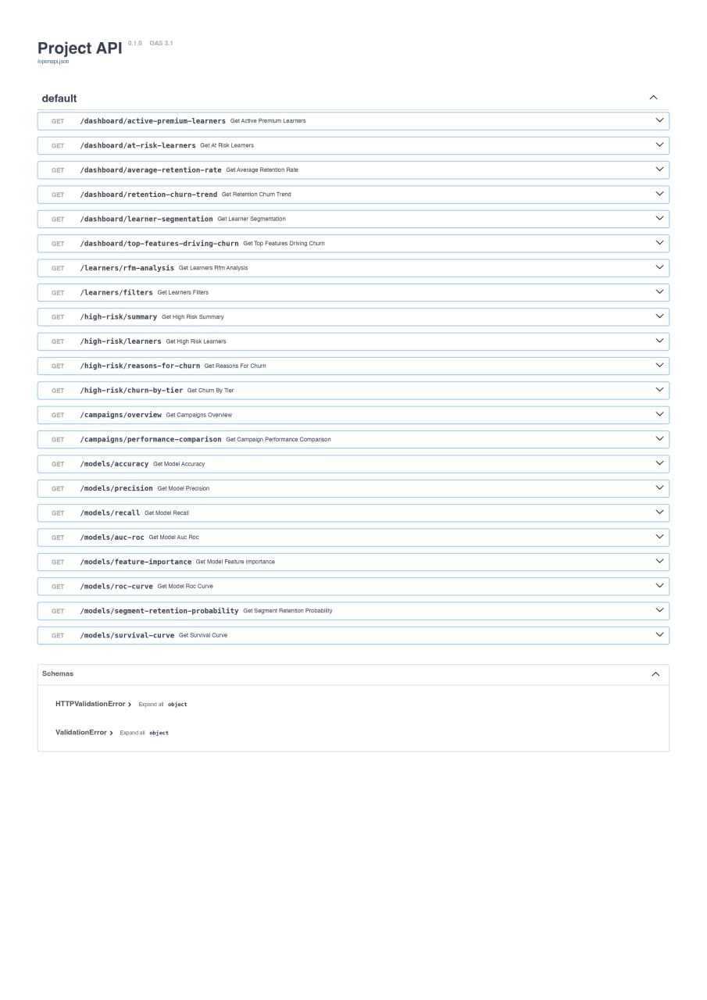
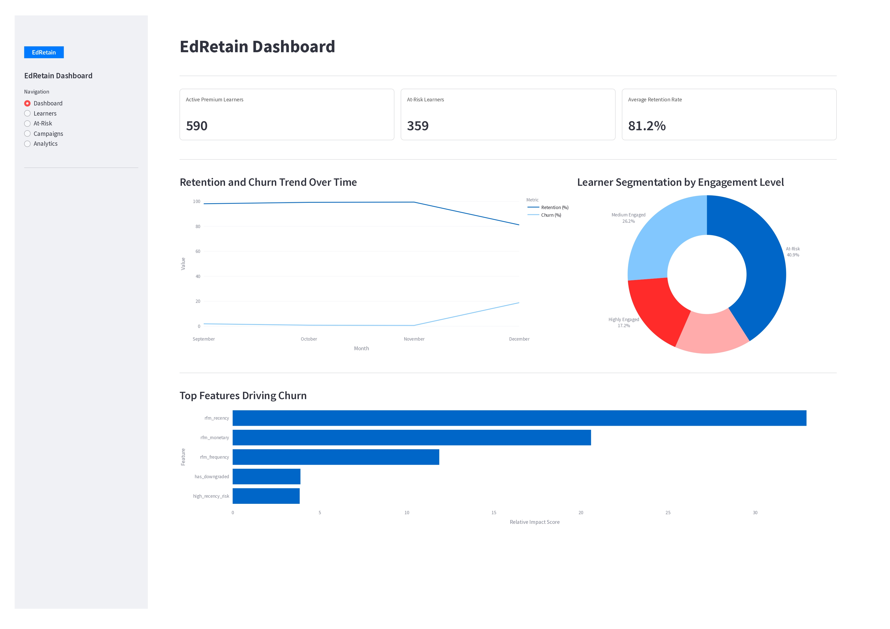
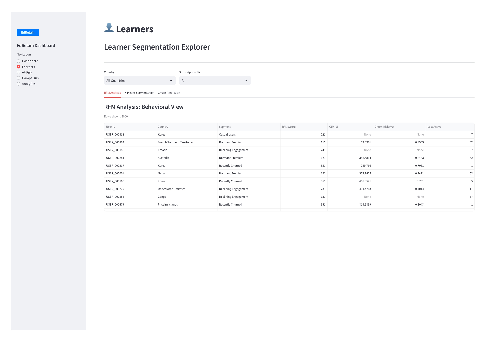
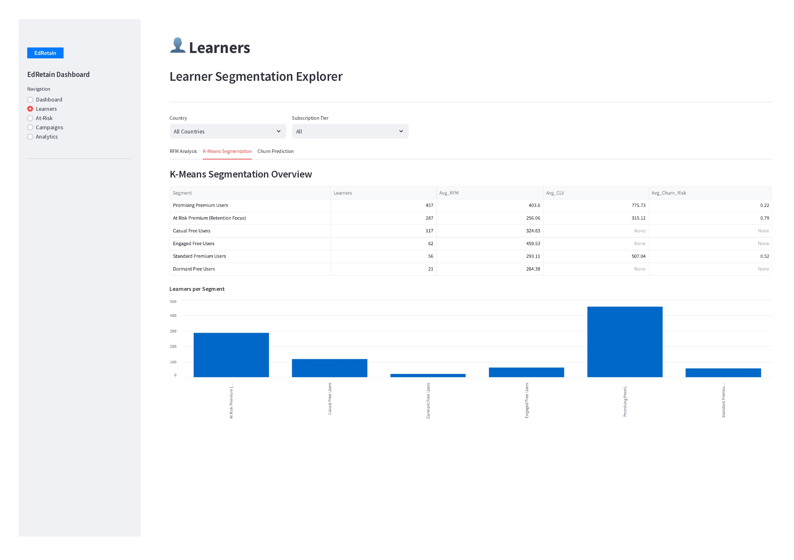
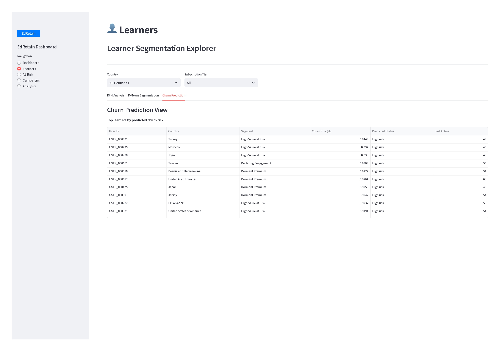
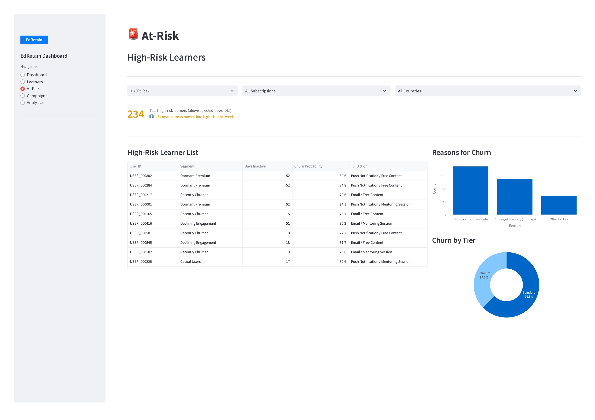
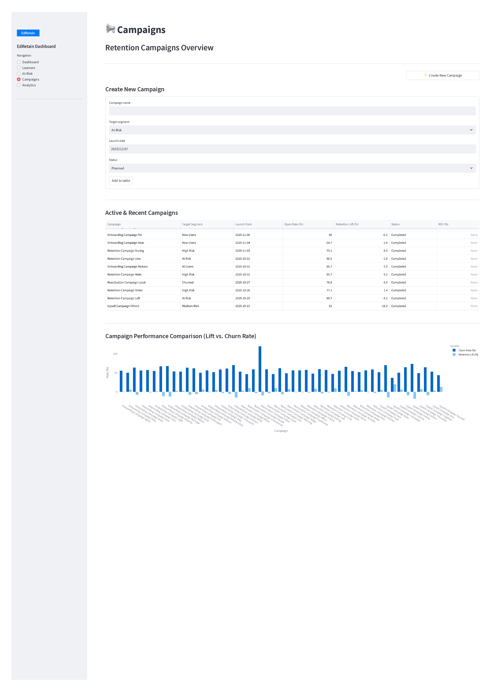
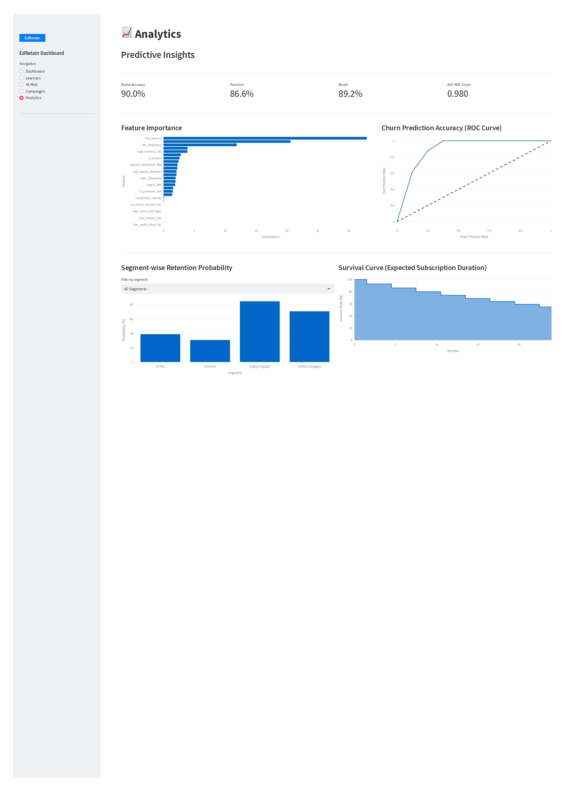
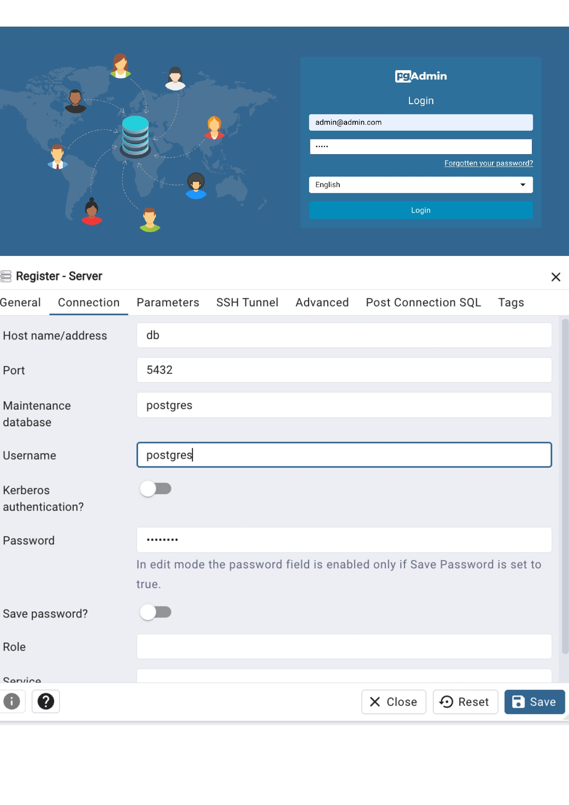

# EdRetain – a smart churn prediction and predictive retention analytics system for premium users in EdTech platforms.


EdRetain is a smart churn prediction and predictive retention analytics system for premium users in EdTech platforms. It predicts which premium users are likely to downgrade or churn by analyzing engagement and spending patterns, enabling timely marketing interventions. The platform integrates data modeling, API access, and a user-friendly UI for actionable retention insights.

---
## Authors

- **Project/Product Manager:** Anzhela Davityan
- **Data Analyst/Scientist:** Arpine Janunts
- **Back-end Developer:** Melanie Melkonyan
- **Database Developer:** Amalya Tadevosyan
- **Front-end Developer:** Anna Mikayelyan


## Installation

Make sure you have Docker and Docker Compose installed on your system.

```bash
git clone https://github.com/DS-223-2025-Fall/group-6.git
cd group-6
docker compose up --build
```

## Access the Application

After running `docker compose up --build`, you can access each component of the application at the following URLs:

- **Streamlit Frontend:** http://localhost:8501 The main interface for managing employees, built with Streamlit. Use this to add, view, update, and delete employee records.

- **FastAPI Backend**: [http://localhost:8008](http://localhost:8008)  
  The backend API where requests are processed. You can use tools like [Swagger UI](http://localhost:8008/docs#/) (provided by FastAPI) to explore the API endpoints and their details.

- **DS Notebook** (http://localhost:8888) Files in the Jupyter Notebook 

- **PgAdmin** : [http://localhost:5050](http://localhost:5050)  
  A graphical tool for PostgreSQL, which allows you to view and manage the database. Login using the credentials set in the `.env` file:

  - **Email**: Value of `PGADMIN_EMAIL` in your `.env` file
  - **Password**: Value of `PGADMIN_PASSWORD` in your `.env` file


## Environment Variables(.env)
```bash
DATABASE_URL=postgresql+psycopg2://postgres:password@db:5432/edretaindb
DB_USER=postgres
DB_PASSWORD=password
DB_NAME=edretaindb
PGADMIN_EMAIL=admin@admin.com 
PGADMIN_PASSWORD=admin
```

## Project Structure

Here’s an overview of the project’s file structure:

## Project Structure

```bash
.
├── .github/
│   └── workflows/
│       └── ci.yaml
├── .venv/                         # Local virtual environment (optional)
├── docs/                          # MkDocs documentation sources
│   ├── api.md
│   ├── app.md
│   ├── demo.md
│   ├── ds.md
│   ├── etl.md
│   ├── index.md
│   ├── ERD.pdf
│   ├── Problem Definition.pdf
│   ├── Product Roadmap.png
│   └── UI_Prototype.pdf
├── EdRetain/                      # Application package
│   ├── api/                       # FastAPI backend
│   │   ├── Database/              # Shared DB module (SQLAlchemy models, engine)
│   │   │   ├── __init__.py
│   │   │   ├── data_generator.py
│   │   │   ├── database.py
│   │   │   └── models.py
│   │   ├── __init__.py
│   │   ├── .gitignore
│   │   ├── Dockerfile
│   │   ├── main.py                # FastAPI entry point
│   │   └── requirements.txt       # Backend dependencies
│   └── app/                       # Streamlit frontend
│       ├── .gitignore
│       ├── app.py                 # Streamlit main dashboard
│       ├── Dockerfile
│       └── README.md
├── ds/                            # Data-science / notebooks service
│   ├── Database/                  # DB access reused by DS
│   │   ├── __init__.py
│   │   ├── data_generator.py
│   │   ├── database.py
│   │   └── models.py
│   ├── Campaign Analysis.ipynb
│   ├── churn_probability.ipynb
│   ├── CLV.ipynb
│   ├── kmeans.ipynb
│   ├── RFM_KPI.ipynb
│   ├── survival_analysis.ipynb
│   ├── helpers.py
│   ├── run_notebooks.py
│   ├── Dockerfile
│   └── requirements.txt
├── etl/                           # ETL service (schema + loading)
│   ├── data/                      # Source CSV files
│   ├── Database/                  # DB models + engine for ETL
│   │   ├── __init__.py
│   │   ├── data_generator.py
│   │   ├── database.py
│   │   └── models.py
│   ├── etl.py                     # ETL entry point
│   ├── helpers.py
│   ├── Dockerfile
│   └── requirements.txt
├── pgadmin_data/                  # Volume for pgAdmin configuration
├── postgres_data/                 # Volume for PostgreSQL data
├── .env                           # Environment variables (DB, pgAdmin, API_URL, …)
├── .gitignore
├── .gitkeep
├── docker-compose.yml             # Multi-service Docker stack
├── LICENSE
├── mkdocs.yml                     # MkDocs configuration
├── README.md
├── requirements_mkdocs.txt        # Documentation dependencies
└── requirements.txt               # Root/shared Python dependencies
```
## Features

### Database Model

### Frontend (Streamlit)

### Backend (FastAPI)

### Requests

#### Dashboard Endpoints
- **GET /dashboard/active-premium-learners** — Returns the latest count of active premium learners and the percentage change from the previous period.
- **GET /dashboard/at-risk-learners** — Returns the latest count of at-risk learners and the absolute change from the previous period.
- **GET /dashboard/average-retention-rate** — Returns the latest overall retention rate and its percentage change.
- **GET /dashboard/retention-churn-trend** — Returns time-ordered monthly retention and churn rates.
- **GET /dashboard/learner-segmentation** — Returns the latest engagement distribution (highly engaged, medium, at-risk, dormant).
- **GET /dashboard/top-features-driving-churn** — Returns ranked feature importance scores from the latest churn prediction model.

#### Learner Endpoints
- **GET /learners/rfm-analysis** — Returns per-learner RFM, churn probability, CLV, and activity metrics with optional filters.
- **GET /learners/filters** — Returns distinct lists of countries and subscription tiers for dropdown filters.

#### High-Risk Learner Endpoints
- **GET /high-risk/summary** — Returns total high-risk learner count and recent (last 7 days) additions.
- **GET /high-risk/learners** — Returns detailed high-risk learner table including inactivity, churn probability, and suggested actions.
- **GET /high-risk/reasons-for-churn** — Returns the latest churn reasons ranked by frequency.
- **GET /high-risk/churn-by-tier** — Returns high-risk learner distribution by subscription tier.

#### Campaign Endpoints
- **GET /campaigns/overview** — Returns all campaigns with key metrics (name, target segment, launch date, open rate, retention lift, status).
- **GET /campaigns/performance-comparison** — Returns campaign performance metrics including churn rates and retention lift.

#### Model Endpoints
- **GET /models/accuracy** — Returns the latest model accuracy and its change from the previous snapshot.
- **GET /models/precision** — Returns the latest precision score and its change.
- **GET /models/recall** — Returns the latest recall score and its change.
- **GET /models/auc-roc** — Returns the latest AUC-ROC value (0–1) and its change.
- **GET /models/feature-importance** — Returns ranked feature importance scores from the latest model snapshot.
- **GET /models/roc-curve** — Returns synthetic ROC curve points (FPR, TPR), or a diagonal baseline if unavailable.
- **GET /models/segment-retention-probability** — Returns average retention probability (1 – churn_probability) per engagement segment.
- **GET /models/survival-curve** — Returns synthetic 24-month survival curve data using exponential decay.


## API Swagger Documentation



## Dashboard UI Screenshots










## pgAdmin Setup



### Documentation

```bash
pip install mkdocs-material mkdocstrings[python] pillow cairosvg
mkdocs serve
```
## Technologies

- **Backend:** FastAPI + SQLAlchemy
- **Frontend:**  Streamlit
- **Database::** PostgreSQL + pgAdmin
- **DS**:  RFM, CLV, KMeans Clustering
- **Documentation:** MkDocs + GitHub Actions
